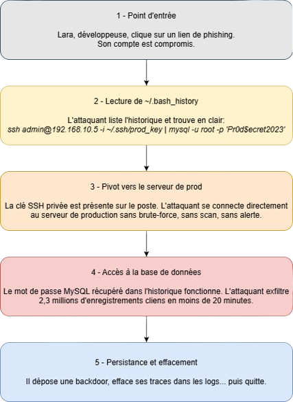

Active Directory : un écosystème fragile
========================================

Active Directory (AD) est au cœur du système d'information : il centralise l'authentification, les droits d'accès et la gestion des ressources. Cette position critique en fait une cible privilégiée.

Sa complexité et l’interdépendance de ses composants le rendent particulièrement fragile : une mauvaise configuration, un droit mal attribué ou une simple exposition d’information peuvent suffire à compromettre l’ensemble du domaine.

Maîtriser finement AD, appliquer le principe du moindre privilège et surveiller en continu les accès ne sont donc pas optionnels, mais essentiels pour garantir la sécurité du système.

Gestion des droits utilisateurs
===============================

Pourquoi les droits doivent être limités
----------------------------------------

Attribuer des droits trop larges, même en lecture seule, peut introduire des failles de sécurité importantes.

Un exemple classique est l'accès au fichier ``.bash_history`` d'un utilisateur. Ce fichier contient l'historique des commandes exécutées dans le terminal, et peut exposer :

- Des mots de passe saisis en clair
- Des commandes d'administration sensibles
- Des chemins vers des fichiers critiques
- Des informations sur l'architecture du système

Même sans accès en écriture, un attaquant peut exploiter ces informations pour :

- Escalader ses privilèges
- Accéder à des services internes
- Rejouer certaines commandes critiques

Exemple d'attaque via .bash_history
----------------------------------

Le diagramme ci-dessous illustre une attaque typique exploitant un fichier ``.bash_history`` accessible en lecture :

Conclusion
----------

Le principe du moindre privilège doit toujours être appliqué :

- Un utilisateur ne doit avoir accès qu'aux ressources strictement nécessaires
- Même les droits en lecture doivent être contrôlés
- Les fichiers sensibles doivent être protégés, y compris contre la simple consultation

The Docs
--------

.. toctree::
   :maxdepth: 2

   tutorials/index
   reference/index
   explanations/index
   community/index
   tutoriel/index

How should I cite NASim?
------------------------

Please cite NASim in your publications if you use it in your research. Here is an example BibTeX entry:

.. code-block:: bash

    @misc{schwartz2019nasim,
    title={NASim: NJP},
    author={Schwartz, Jonathon and Kurniawatti, Hanna},
    year={2019},
    howpublished={\url{https://Julpic08.readthedocs.io/}},
    }

Indices and tables
==================

* :ref:`genindex`
* :ref:`modindex`
* :ref:`search`

.. _GitHub: https://github.com/Jjschwartz/NetworkAttackSimulator
